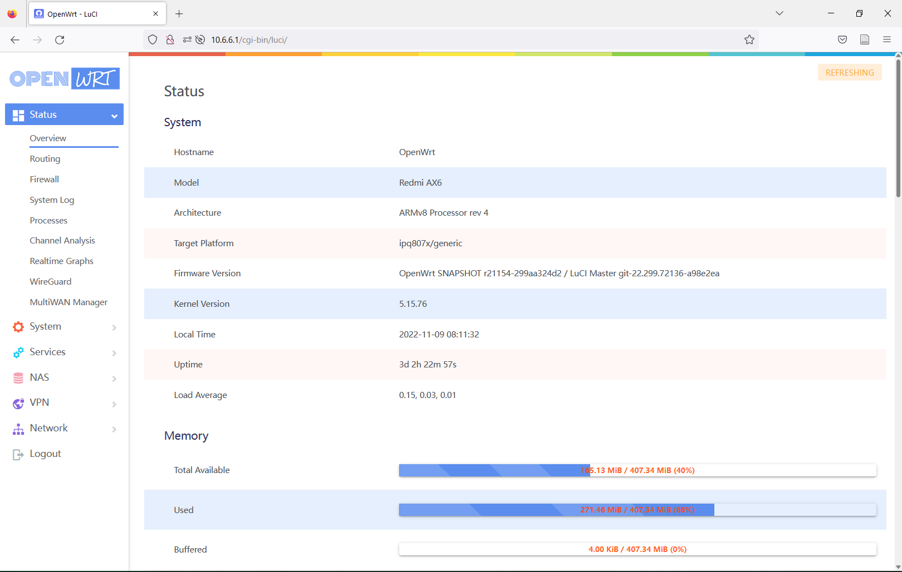

## Specs / Languages / IP / Password
   | project | value |
   | :--- | :--- |
   | Default IP address | `10.6.6.1` |
   | Default password | `password` |
   | Default languages | `english` |
   | Packages basic | `cpufreq, ddns, openvpn, openvpn-server, upnp, wireguard, edge-theme` |
   | Packages standard | `adblock, cpufreq, ntpc, ddns, openvpn, openvpn-server, sqm, upnp, wifischedule, wireguard, wizard, argon-theme, edge-theme` |
   | Packages full | `adblock, adguardhome, argon-config, cpufreq, ntpc, ddns, multiwan3, openvpn, openvpn-server, qbittorrent, rclone, smartdns, sqm, upnp, wifischedule, wireguard, zerotier, vsftpd, wizard, argon-theme, edge-theme` |
   
#### Note: Maybe you have to increase your partitions if you like to fit Full version of this firmware, tutorial here: https://forum.openwrt.org/t/adding-openwrt-support-for-xiaomi-ax3600/55049/8749

# About this repository

> This repository is based on [P3TERX/Actions-OpenWrt](https://github.com/P3TERX/Actions-OpenWrt) 
> OpenWRT branch from [robimarko/openwrt](https://github.com/robimarko/openwrt/tree/ipq807x-5.15-pr) 
> OpenWRT packages from [kiddin9/openwrt-packages](https://github.com/kiddin9/openwrt-packages) 

## Features

* Adguardhome
* Argon-theme
* Sqm
* Wireguard
* Openvpn
* Adblock
* Smartdns
* Wifischedule
* Wake-On-LAN
* DDNS
* Python(It is mainly used for scripts, so the router is so large because it is hung up. 😂)
* More functions by themselves (may be refreshed from time to time to check)...

## Instructions

1. Upload your own `AX6-LEDE.config` file (depending on which branch you want to be on)
2. Enter the Actions page to manually start the compilation
3. When the compilation is complete, download the compiled `xxx-factory.ubi` firmware on the Releases page.
4. If you have previously flashed dual systems to AX6, please enter `fw_setenv flag_last_success=1` and `fw_setenv flag_boot_rootfs=1` and then restart the device to switch the system (if not, please click the [reference link(Please solve the translation problem yourself)](https://www.right.com.cn/forum/thread-6054985-1-1.html) to install the dual system)
5. Upload the firmware with the suffix of .ubi via scp
6. Flashing in the firmware `ubiformat /dev/mtd13 -y -f /tmp/openwrt-xxx-redmi_ax6-squashfs-nand-factory.ubi` PS: The file name is just an example. When flashing in, the ubi file name you downloaded will prevail
7. Enter `fw_setenv flag_last_success=0` and `fw_setenv flag_boot_rootfs=0` and then restart the device

## Instructions（with uboot）

1. If you haven't flashed it, please flash uboot first, and the second step if you have flashed it. [123pan(Extraction password：88g5 compressed file password：RA69)](https://www.123pan.com/s/o17DVv-hClm) [Google Drive(compressed file password：RA69)](https://drive.google.com/file/d/1cuJoNP-8yTMXOVPIBPK1KmOOsvPcJbFU/view?usp=sharing)
2. After flashing, please plug in the power supply and use the card pin or any object to hold down the reset hole of the AX6 router for 5 seconds until the red light turns on, modify the ip to 192.168.1.10 and the gateway to 192.168.1.1 to enter uboot
3. Upload the firmware with the .ubi suffix, wait for the automatic restart, and complete

## Screenshot

## Issues
#### Disclaimer: The following known issues are all personal measurements, and there may be unknown issues. I am not responsible for any issues caused by the firmware

* (update)The problem of luci stuck due to memory seems to be fixed (I haven't seen luci crash for several days after booting), but due to at least 5.15 kernel, it can't open 160Mhz.

## Credits

* [Microsoft Azure](https://azure.microsoft.com/)
* [GitHub Actions](https://github.com/features/actions)
* [OpenWRT](https://github.com/openwrt/openwrt)
* [tmate](https://github.com/tmate-io/tmate)
* [P3TERX](https://github.com/P3TERX)
* [smith97](https://www.right.com.cn/forum/thread-6054985-1-1.html)
* [robimarko/openwrt](https://github.com/robimarko/openwrt/tree/ipq807x-5.15)
* and all OpenWRT/LEDE related contributors
* [kiddin9/openwrt-packages](https://github.com/kiddin9/openwrt-packages)
